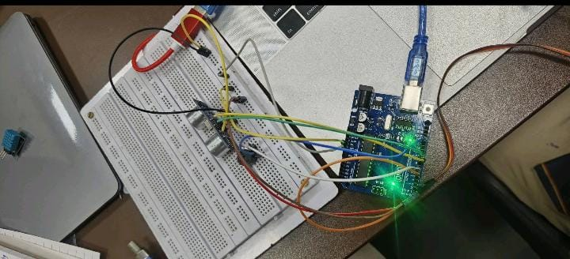
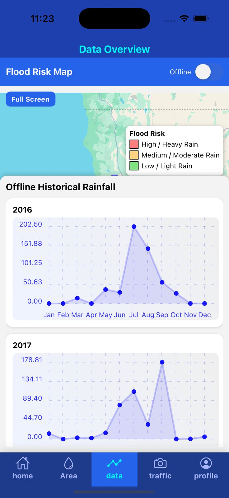
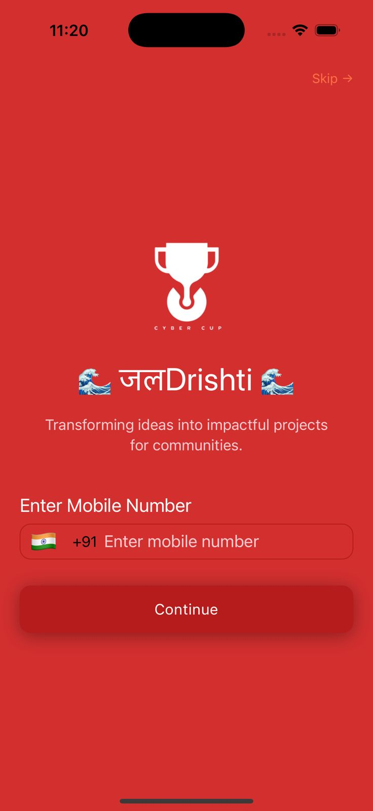
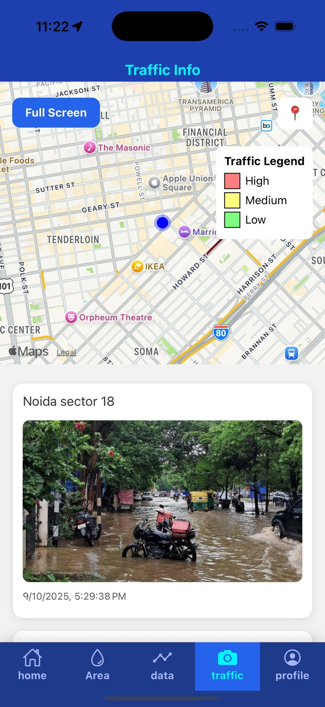
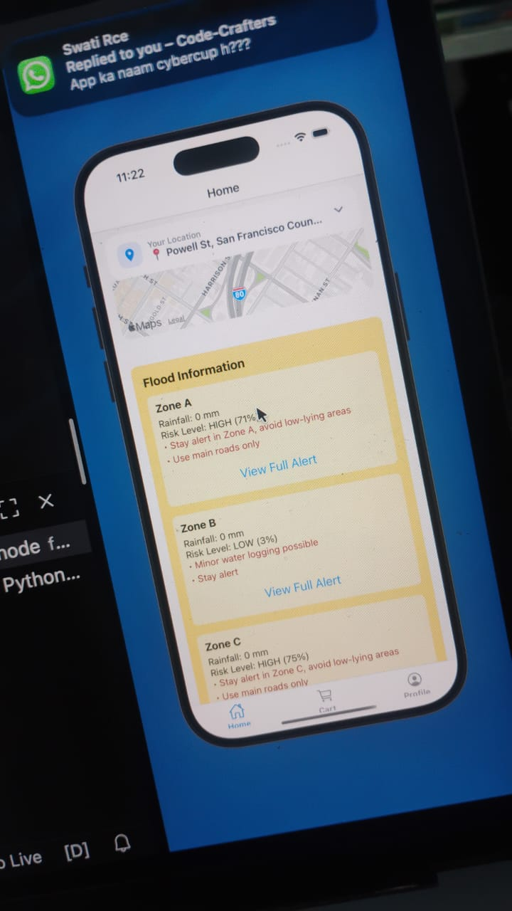

# 🌊 JalDrishti – Real-Time IoT + AI Flood Monitoring Platform

A full-scale **IoT + AI-powered flood monitoring, prediction, and citizen safety platform** built using **Django REST Framework, React Native, React.js, ESP32/NodeMCU IoT sensors, and ML models**.

---

## 🚀 Overview

<p align="center">
  
</p>

Communities living near rivers, canals, and flood-prone areas often suffer due to *zero visibility* of rising water levels. JalDrishti solves this by providing:

- Real-time water-level monitoring using IoT sensors  
- AI-driven flood prediction (85% accuracy)  
- Live alerts to 1,000+ users  
- Safe-route guidance via mobile app  
- GIS-based dashboard for authorities  

---

## 🛰️ Key Features

### 🔹 **IoT-Based Water Level Tracking**

<p align="center">
  
</p>

- ESP32/NodeMCU sensors  
- Ultrasonic/float sensors  
- Weather API ingestion  
- 92% real-time data reliability  

---

### 🔹 **AI/ML Flood Prediction**

<p align="center">
  
</p>

- Trained on historic rainfall + water-level datasets  
- Probability scoring (0–100%)  
- Prediction accuracy: **85%**  

---

### 🔹 **Citizen Mobile App (React Native)**

<p align="center">
  
</p>

- Flood alerts  
- Live water levels  
- Zone risk colors  
- Safe-route navigation  

---

### 🔹 **GIS Admin Dashboard (React.js)**

<p align="center">
  
</p>

- Map-based zone monitoring  
- Sensor health  
- Emergency broadcast tools  
- Historical analytics  

---

## 🏗️ Architecture

<p align="center">
  
</p>


### **1. IoT Layer**
- Sends water-level every 10–30 sec  
- Data → REST API  

### **2. Backend (Django DRF)**  
- Token-based auth  
- Flood prediction engine  
- Data storage  
- Alerts engine  

### **3. Admin Dashboard (React.js)**  
- GIS visualization of risk zones  

### **4. Mobile App (React Native)**  
- Real-time flood information for citizens  

---

## 🔧 Tech Stack

- **Backend:** Django REST Framework  
- **Frontend:** React Native, React.js  
- **IoT:** NodeMCU / ESP32  
- **Database:** PostgreSQL / SQLite  
- **ML Models:** Random Forest / XGBoost  
- **Maps:** Leaflet / Google Maps API  

---

## 📸 Screenshots

<p align="center">
  
</p>

---

## 🛠️ Installation

### 📌 Clone Repository

```bash
git clone <repo-url>
cd JalDrishti
cd backend
pip install -r requirements.txt
python manage.py migrate
python manage.py runserver

Upload the Arduino/ESP32 code:

HTTPClient http;
http.begin("<backend-url>/api/sensor/update/");
http.addHeader("Content-Type", "application/json");
📌 React Native App
